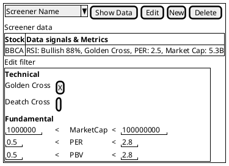

# My Thinking
## What user want to understand

This is usecase for the user.

### Techinal

#### Price Data
- What is price data

#### Technical Indicator
- What is a specific indicator means
- How is it calculated

#### Signal
- What is a specific signal means
- How is it detected

### Fundamental

#### Financial Data
- What is financial data
- What is a specific financial data means

#### Metric
- What is metric data
- What is a specific metric data means

#### Signal
- What is specific signal means
- How is it detected

## What user want to know (to make trading decision)

### Techinal

- Show price data / chart of a Stock
- Show a specific indicator data / chart of a Stock
- Show a specific signal of a Stock
- Show all signals of a Stock
- Show sorted signals by its significance / strength

display information of technical signal indicates:
- Bullish -> price up trending
- Bearish -> price down trending
- Oversold   -> Nearly change trend from downward to upward
- Overbought -> Nearly change trend from upward to downward

### Fundamental

- Show how big the company
- Show how healthy

display information of fundamental signal indicates:
- Show whether the market price too expensive or too cheap
- Potential of company value going up or going down

# What chatgpt said about stock screener

A **stock screener** is a tool used by traders and investors to **filter and discover stocks** that meet specific criteria from the thousands available in a market. It helps narrow down potential trading or investment opportunities efficiently.

---

### 🧭 **Purpose and Use Cases**

A stock screener allows users to **search, sort, and filter** stocks based on both **fundamental** and **technical** parameters. Typical use cases include:

1. **Finding undervalued or overvalued stocks**
   → Example: P/E ratio < 10, high dividend yield.

2. **Identifying growth opportunities**
   → Example: Quarterly EPS growth > 20%, strong revenue momentum.

3. **Technical trading setups**
   → Example: RSI < 30 (oversold), price crossing above 200-day moving average.

4. **Sector or theme analysis**
   → Example: Filter for renewable energy stocks with market cap > $1B.

5. **Pre-market or intraday scans**
   → Example: Stocks with abnormal volume or gap up/down at market open.

---

### 📊 **Information Typically Shown in a Stock Screener**

Users expect to see **a table or dashboard** with columns of data and the ability to filter or sort by them. Common fields include:

#### **Fundamental Data**

| Category              | Examples                                                        |
| --------------------- | --------------------------------------------------------------- |
| **Price & Valuation** | Current price, Market Cap, P/E ratio, P/B ratio, PEG ratio      |
| **Financials**        | Revenue, EPS (Earnings Per Share), Net Income, Debt/Equity, ROE |
| **Dividends**         | Dividend Yield, Payout Ratio, Ex-Dividend Date                  |
| **Growth Metrics**    | EPS growth (YoY), Revenue growth (QoQ), Analyst estimates       |

#### **Technical Data**

| Category               | Examples                                        |
| ---------------------- | ----------------------------------------------- |
| **Price Action**       | % change today, 52-week high/low, volatility    |
| **Volume Indicators**  | Average daily volume, relative volume, turnover |
| **Trend Indicators**   | Moving averages (50-day, 200-day), MACD, RSI    |
| **Patterns & Signals** | Breakouts, Crossovers, Candlestick patterns     |

#### **Descriptive Filters**

| Category              | Examples                        |
| --------------------- | ------------------------------- |
| **Exchange / Market** | NASDAQ, NYSE, IDX, etc.         |
| **Sector / Industry** | Technology, Finance, Healthcare |
| **Country / Region**  | U.S., Indonesia, Japan, etc.    |

---

### 🧠 **Typical User Expectations**

A well-designed screener provides:

* **Real-time or near-real-time data**
* **Custom filters and saved presets** (e.g., “Momentum Stocks” or “High Dividend”)
* **Interactive charts or quick technical view**
* **Export options** (CSV, Excel)
* **Integration with broker or trading platform** for quick order execution
* **Alerts** when a stock meets certain criteria

---

### ⚙️ **Examples in Practice**

* **Retail tools:** Yahoo Finance, TradingView, Finviz, Stockbit (Indonesia), Investing.com
* **Professional terminals:** Bloomberg, Refinitiv, Thinkorswim, Interactive Brokers TWS
* **Custom apps:** Many trading systems or proprietary tools embed a screener module linked to live market feeds and backtesting engines.

---

# My Idea of GUI

Screer name example:
- Cheap big company on reversal
- Expensive Medium company over-bought
- etc

Edit tab will show editor to change parameter of each metric criteria or signal valuation.
